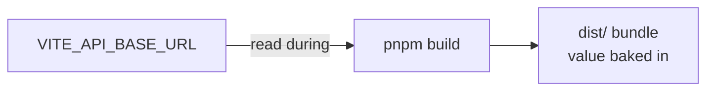

# 02 · Environment Variables (Build-Time)

Vite exposes only variables prefixed with `VITE_` to the app, and **inlines them at
build time**. There is no runtime env on a static host.

---

## Variables

| Variable            | Required | Example                          | Notes                                                                |
| ------------------- | :------: | -------------------------------- | -------------------------------------------------------------------- |
| `VITE_API_BASE_URL` | **yes**  | `https://api.example.com/api/v1` | Backend base URL. **Must include** `/api/v1`. **No** trailing slash. |

From `.env.example`:

```
VITE_API_BASE_URL=http://localhost:3000/api/v1
```

---

## The build-time rule (important)



- Setting it in the host **runtime** does nothing — it must be present **when the build
  runs**.
- Changing it later requires a **rebuild/redeploy**, not a restart.
- The value is **public** (visible in the shipped JS). Never put secrets in `VITE_*`.

---

## Where to set it, per host

| Host                  | Where                                                             |
| --------------------- | ----------------------------------------------------------------- |
| Vercel                | Project → Settings → Environment Variables (Production + Preview) |
| Netlify               | Site settings → Environment variables                             |
| Cloudflare Pages      | Project → Settings → Environment variables (Production + Preview) |
| Azure Static Web Apps | Build configuration / workflow env                                |
| S3 + CloudFront       | Set in the CI build step before `pnpm build`                      |
| VPS build             | Export before `pnpm build` (or in CI)                             |

---

## Per-environment values

```bash
# Local
VITE_API_BASE_URL=http://localhost:3000/api/v1

# Preview/staging (point at a staging API)
VITE_API_BASE_URL=https://staging-api.example.com/api/v1

# Production
VITE_API_BASE_URL=https://api.example.com/api/v1
```

> **Warning:** The production API's `CORS_ORIGIN` must include this FE's origin, and this
> `VITE_API_BASE_URL` must exactly match the API's public URL + `/api/v1`. Mismatches
> are the #1 cause of "it's deployed but nothing loads".

Continue to [Chapter 03 · Free-Tier Deploy](03-free-tier.md).
