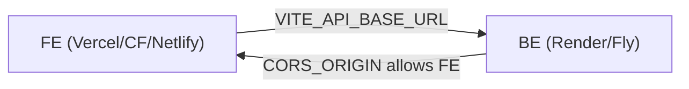

# 03 · Free-Tier Deployment (Recommended)

> **Goal:** ship the SPA for **$0**. The frontend free tiers are excellent and have **no
> cold starts** (static assets on a CDN). Cold-start concerns apply only to the backend.

> **Warning:** Deploy the backend first and add the SPA fallback
> ([Chapter 01](01-prerequisites.md)). You need the backend HTTPS URL for
> `VITE_API_BASE_URL`.

---

## Recommended: Vercel (simplest) or Cloudflare Pages (biggest free tier)

### Option 1 — Vercel

> **Time:** ~10 min. **Cost:** $0 (Hobby).

1. Vercel → **Add New → Project** → import `my-school-FE`.
2. Framework auto-detected: **Vite**. Build `pnpm build`, output `dist`.
3. Env var (Production + Preview): `VITE_API_BASE_URL=https://<be-domain>/api/v1`.
4. Deploy → note `https://<project>.vercel.app`.
5. In the backend, set `CORS_ORIGIN` to that URL and redeploy the backend.

SPA fallback: automatic on Vercel (optionally add `vercel.json`, see
[Chapter 01](01-prerequisites.md)).

### Option 2 — Cloudflare Pages

> **Time:** ~10 min. **Cost:** $0 (very generous).

1. Cloudflare → **Workers & Pages → Create → Pages → Connect to Git** → `my-school-FE`.
2. Build `pnpm build`, output `dist`.
3. Env var: `VITE_API_BASE_URL=https://<be-domain>/api/v1`.
4. Add `public/_redirects` with `/* /index.html 200` (required).
5. Deploy → note `https://<project>.pages.dev`; set backend `CORS_ORIGIN` and redeploy BE.

### Option 3 — Netlify

Same idea; requires `_redirects` or `netlify.toml`. See
[04-platforms/netlify.md](04-platforms/netlify.md).

---

## Connect FE ↔ BE (all options)

- `VITE_API_BASE_URL` (FE build) → `https://<be>/api/v1`
- `CORS_ORIGIN` (BE) → `https://<fe>` (no trailing slash)
- Redeploy whichever side you changed.

---

## Free-tier gotchas

| Gotcha                                  | Fix                                                             |
| --------------------------------------- | --------------------------------------------------------------- |
| Changed API URL, FE still calls old one | Vite inlines env at build → **redeploy** FE                     |
| 404 on refresh/deep link                | Add SPA fallback (`_redirects`/`vercel.json`)                   |
| CORS error in console                   | Fix backend `CORS_ORIGIN` (exact origin, no slash), redeploy BE |
| Mixed content blocked                   | Backend must be HTTPS                                           |
| Backend slow on first call              | Backend cold start (free BE hosts) — see BE guide               |

Pair with the always-on backend variant (Fly.io) from
`my-school-BE/deployment/06-free-tier.md` for a snappy demo.

Continue to [Chapter 04 · Platforms](04-platforms/).
